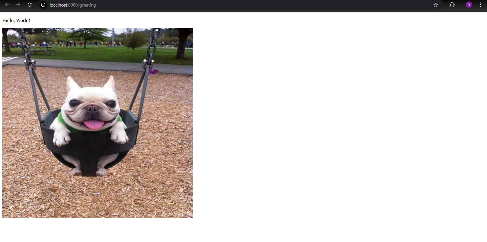

# Task 1 – First Java Spring Boot Application

## Description
This project is a simple Spring Boot application created as Task 1.
It demonstrates the basic usage of Spring Boot, controllers, static resources,
and HTML templates.

The application exposes simple HTTP endpoints and returns text or HTML content
in the browser.

---

## Technologies Used
- Java
- Spring Boot
- Maven
- Thymeleaf
- IntelliJ IDEA

---

## Project Structure
- `src/main/java/pl/edu/vistula/first_java_spring_project/Controller/HelloController.java`
  – REST controller handling HTTP requests

- `src/main/java/pl/edu/vistula/first_java_spring_project/FirstJavaSpringProjectApplication.java`
  – main Spring Boot application class

- `src/main/resources/templates/greeting.html`
  – HTML page rendered using Thymeleaf

- `src/main/resources/static/images/buldog.jpg`
  – static image resource

- `src/main/resources/application.properties`
  – application configuration file

- `README.md`
  – project documentation

---

## How to Run the Application
1. Open the project in IntelliJ IDEA
2. Make sure Java and Maven are installed
3. Run the main class:
   `FirstJavaSpringProjectApplication`
4. Application will start on:
   http://localhost:8080/greeting

---

## Result
The browser displays:
- Text: **Hello, World!**
- An image loaded from static resources

---

## Screenshot

Greeting page (/greeting):

